<p align="center">
  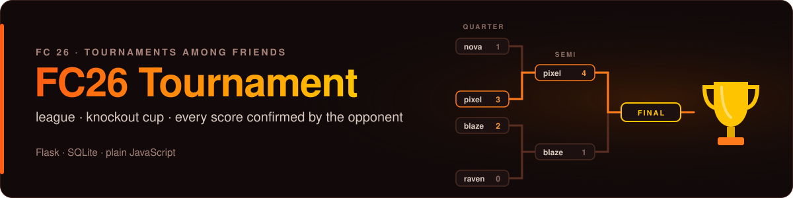
</p>

<p align="center">
  <b>Run an FC 26 night with your friends</b>: one invite link, a league or a knockout cup, and no score counts until the opponent confirms it.<br>
  <sub>A small Flask + SQLite web app with plain JavaScript pages. Runs on a laptop, or deployed with gunicorn.</sub>
</p>

<p align="center">
  
  
  
  <a href="LICENSE"></a>
</p>

<p align="center">
  <a href="#features"></a>
  <a href="#how-it-works"></a>
  <a href="#how-it-grew"></a>
  <a href="#concepts-in-practice"></a>
  <a href="#quick-start"></a>
  <a href="#deployment"></a>
  <a href="#project-structure"></a>
</p>

<p align="center">
  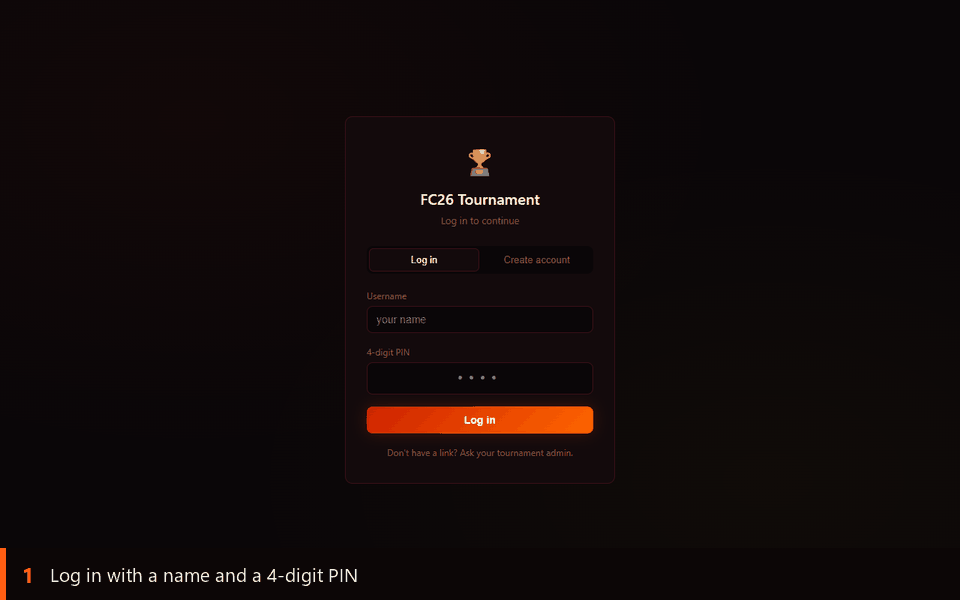
</p>

## Why I built it

> **[CHECK]** *Draft, rewrite in your own words:* My friends and I play FC26 together, and we wanted a real tournament: a league table, knockout rounds, and results everyone agrees on. I had just learned in BVS2 how clients and servers talk to each other, and I realised that was enough to build it myself.

## Features

The app is built around the actual game night: someone sets up a tournament, everybody plays on one console, and nobody wants to argue about scores afterwards. **Pick one to see it:**

<details>
<summary><b>Fair team assignment</b> · the strongest matching FC 26 teams, one per player</summary>
<br>
<p align="center">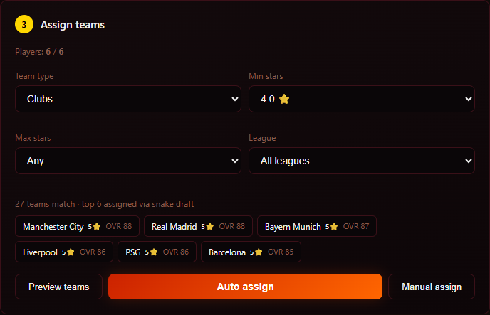</p>

Filter the 136 teams by clubs or national teams, star range and league, preview the result, then **Auto assign**. Each player gets one team, all taken from the top of the filtered pool, so the gap between the weakest and the strongest team stays small. You can also assign by hand, or reassign a team later from the Manage page.
</details>

<details>
<summary><b>Score validation</b> · a result only counts once the opponent confirms it</summary>
<br>
<p align="center">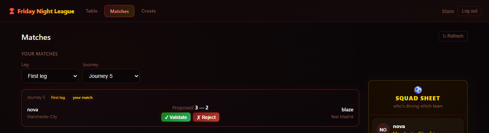<br>
<sub><b>The opponent</b> sees the proposed score and validates or rejects it</sub></p>
<p align="center">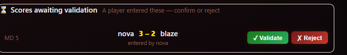<br>
<sub><b>Supervisors</b> get one queue of everything still waiting</sub></p>

One player enters the score, and it stays *pending*. Only the other player can accept it (you can't confirm your own), and a rejected score is cleared so both can resubmit. Supervisors can confirm or enter any score when someone has already gone home.
</details>

<details>
<summary><b>Knockout that runs itself</b> · the next round appears when the last result is in</summary>
<br>
<p align="center">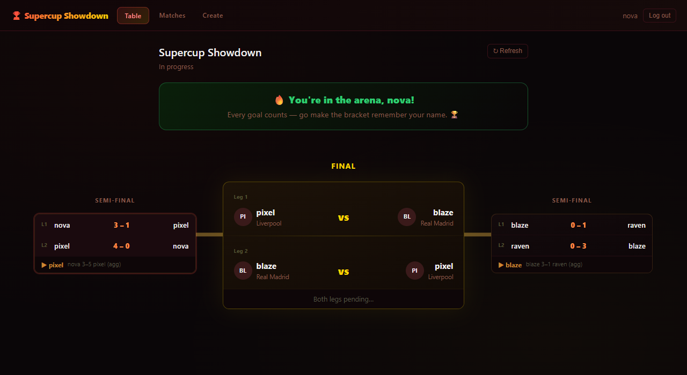</p>

As soon as the last tie of a round is confirmed, the server works out the winners (aggregate score over two legs, away goals as tie-breaker) and creates the next round. Nobody has to press "next round". If a match never gets played, the super-admin can force the round forward with a 0-0 walkover.
</details>

<details>
<summary><b>Live bracket</b> · from the first round to the champion, future rounds as TBD</summary>
<br>
<p align="center">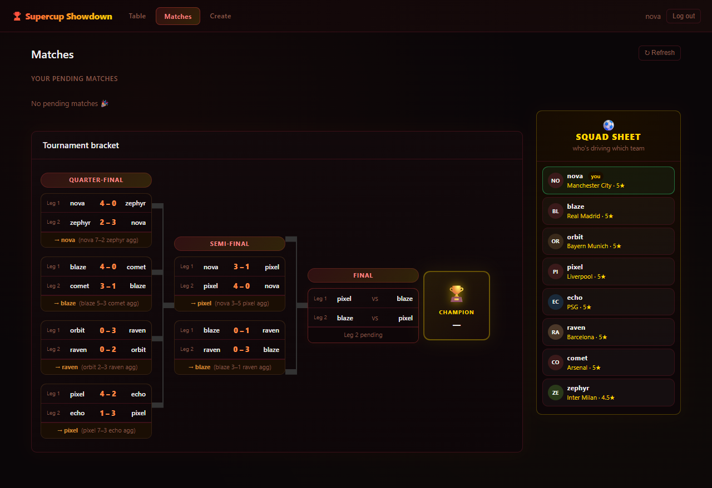</p>

Every tie shows leg 1, leg 2 and the aggregate with the player who goes through. Rounds that don't exist yet are already drawn as TBD, so everyone sees how far it is to the final. Single-leg cups show one game per tie.
</details>

<details>
<summary><b>Your next match first</b> · leg and matchday filters instead of one long list</summary>
<br>
<p align="center">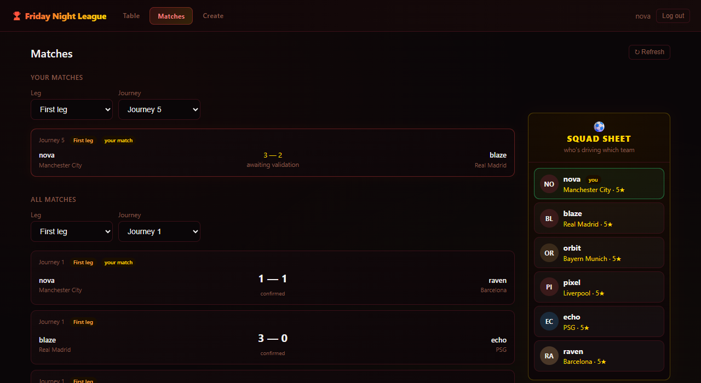</p>

A two-leg league with eight players has 56 games. So the Matches page opens on *your* next pending match and filters everything else by leg and matchday. The same filter works on the Manage page.
</details>

<details>
<summary><b>Spectator mode</b> · people who aren't playing can still follow along</summary>
<br>
<p align="center">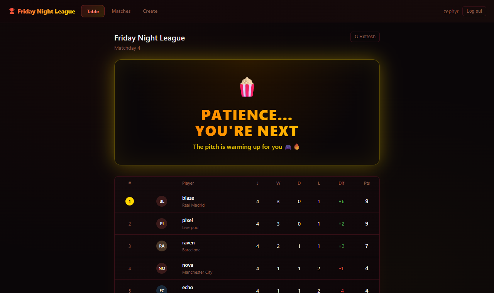</p>

Everyone who logs in lands on the live tournament, even without the invite link. People who aren't in it see the table and the bracket under a *„Patience… you're next“* banner instead of an empty page.
</details>

<details>
<summary><b>Banners that know who you are</b> · a cheer for players, patience for everyone else</summary>
<br>
<p align="center">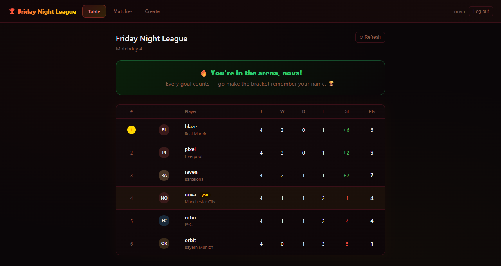</p>

Players get *„You're in the arena, &lt;name&gt;!“* and their own row highlighted. The banner depends on whether you actually play in this tournament, not on your role, so an admin who plays gets the cheer too.
</details>

<details>
<summary><b>Squad Sheet and champion celebration</b> · who drives which team, and a proper finish</summary>
<br>
<p align="center">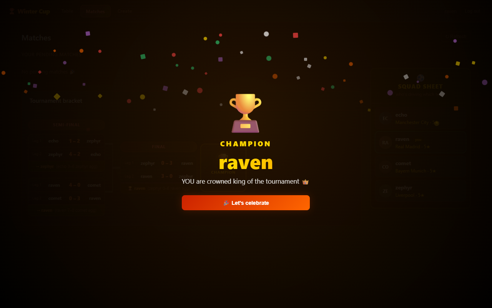</p>

Next to the bracket, the Squad Sheet lists every player with their team and stars, and the chips shrink as the field grows. When the final is decided, everyone gets a full-screen trophy with confetti, shown once per tournament on each device.
</details>

<details>
<summary><b>Works on a phone</b> · mobile-only layout, desktop untouched</summary>
<br>
<p align="center">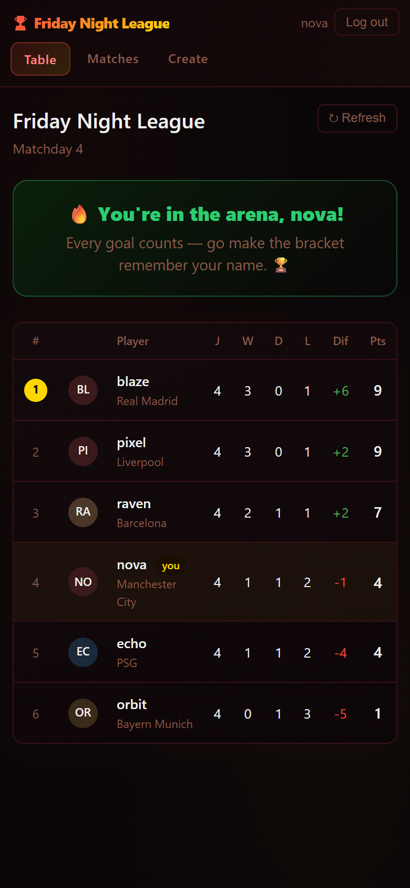</p>

On a phone the navigation wraps into a scrollable row, long names are cut off cleanly, and the bracket on the Table page scrolls sideways. All of this sits in one `@media` block, so the desktop layout is untouched.
</details>

**Also in the app:** invite links · two formats (league or knockout, 1 or 2 legs) · supervisor role, rename, walkover, delete · activity log of every action.

<sub>All names in screenshots and the demo are invented (`seed_demo.py`). Team names come from the FC 26 player dataset.</sub>

<a name="how-it-works"></a>
## How it works

**A tournament, start to finish**

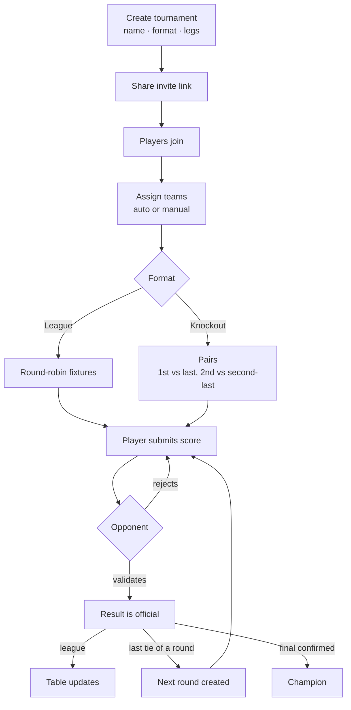

**The architecture**

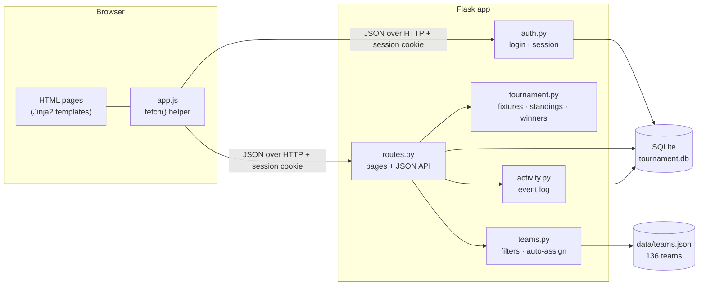

<a name="how-it-grew"></a>
## How it grew

| When | Commits | What happened |
|---|---|---|
| **11.06.2026**, 01:11–01:22 | 3 | The whole app lands in one commit (about 3,500 lines), then deploy prep for Railway |
| 11.06, 01:54–02:45 | 3 | Remove player, **score validation**, manual team assignment |
| 11.06, 04:03–05:30 | 17 | The presentation push: bracket with TBD rounds, spectator mode, banners, Squad Sheet, champion celebration, then the mobile layout |
| **12.06.2026**, 21:58–22:47 | 9 | Tools for running it live: supervisors, walkover, team reassignment, rename, leg and matchday filters, validation queue |
| **29.09.2026** | 7 | Cleanup: configurable admin, single-leg bracket fix, demo data, this README |

<a name="concepts-in-practice"></a>
## Concepts in practice

Where topics from the module *Betriebssysteme und Verteilte Systeme 2* (TH Köln) show up in this code. Each excerpt is the smallest piece that shows the idea, with one comment per line; the link under it leads to the full code.

<details>
<summary><b>Client-server with a REST-style JSON API</b> · the browser asks, Flask answers in JSON</summary>
<br>

**In plain words.** The browser is the client and only draws. The Flask app is the server and only answers. Every page asks for its data with an HTTP request to a URL that names one thing (the matches of tournament 2, one match, one tournament) and gets JSON back. It's REST-*style* rather than strict REST, because a few URLs like `/start` or `/advance-round` name an action, not a thing.

The client, in the browser:
```js
const res  = await fetch(url, opts);    // CLIENT: send the HTTP request, wait for the response
const data = await res.json();          // the body is JSON -> turn it into a JS object
```
The server, in Flask:
```python
@routes_bp.route('/api/tournament/<int:tid>/matches')   # a RESOURCE: the matches of one tournament. GET only
def get_matches(tid):                                    # tid comes out of the URL, already an int
    # ... login check and database query (see full code)
        return jsonify([dict(r) for r in rows])          # rows -> list of dicts -> JSON body, status 200
```
Full code: [`static/app.js` lines 6–21](static/app.js#L6-L21) · [`routes.py` lines 422–442](routes.py#L422-L442)

> **[CHECK] Why I did it this way:** *In your words. For example, why the pages fetch JSON instead of rendering everything on the server, and what that made easier (live refresh, spectator view, same API for every page).*
</details>

<details>
<summary><b>Stateless HTTP with a session cookie</b> · the server forgets you after every request</summary>
<br>

**In plain words.** HTTP has no memory: every request arrives on its own. So at login Flask writes the user's ID into the **session**, which travels to the browser as a signed cookie. The browser sends it back with every request, and every protected route reads it again. The server keeps nothing in between.

```python
app.secret_key = os.environ.get('SECRET_KEY', secrets.token_hex(32))   # SIGNS the cookie so the client cannot forge it
session['user_id'] = user['id']          # LOGIN: the id goes into the session -> the signed cookie
if 'user_id' not in session:             # EVERY request: read the cookie again, nothing was remembered
    return jsonify({'error': 'Not logged in'}), 401   # no cookie -> 401, not a silent 200
```
Full code: [`app.py` line 9](app.py#L9) · [`auth.py` lines 34–50](auth.py#L34-L50) · [`routes.py` lines 19–22](routes.py#L19-L22)

> **[CHECK] Why I did it this way:** *In your words. For example, why a signed cookie and not a server-side session table, and why a 4-digit PIN was enough for a game night.*
</details>

<details>
<summary><b>Explicit HTTP status codes</b> · every failure says what kind of failure it is</summary>
<br>

**In plain words.** The status code lets the client react without reading the error text. Submitting a score checks four things in order, and each "no" has its own code. Without the explicit number, Flask would answer 200 and the error would look like a success.

```python
# 1. are both scores there?          no -> 400: the request itself is incomplete
if hs is None or as_ is None: return jsonify({'error': 'Both scores required'}), 400
# 2. does the match exist?           no -> 404: request fine, the thing is not there
if not match: return jsonify({'error': 'Match not found'}), 404
# 3. are you in this tournament?     no -> 403: you are known, but not allowed
if not my_part: return jsonify({'error': 'Not in this tournament'}), 403
# 4. does it fit the current state?  no -> 409: the result is already official
if match['home_score'] is not None: return jsonify({'error': 'Result already validated'}), 409
```
Full code: [`routes.py` lines 446–481](routes.py#L446-L481)

> **[CHECK] Why I did it this way:** *In your words. For example, what the frontend does differently with a 409 than with a 403.*
</details>

<details>
<summary><b>Idempotency</b> · joining twice is the same as joining once</summary>
<br>

**In plain words.** A request is *idempotent* if sending it twice leaves the server in the same state as sending it once. `POST` normally isn't, but joining a tournament is built that way: the second time, the server finds you already in and changes nothing. A double tap on a phone does no harm.

```python
# look up: is this user already in this tournament?   (None = not yet)
already = db.execute('SELECT id FROM participants WHERE tournament_id=? AND user_id=?', (tid, session['user_id'])).fetchone()
# yes -> answer ok and change NOTHING: the 2nd request ends here
if already: return jsonify({'ok': True, 'message': 'Already joined'})
# ... (is the tournament full? see full code)
# only the FIRST request gets here and writes the row
db.execute('INSERT INTO participants (tournament_id, user_id) VALUES (?,?)', (tid, session['user_id']))
```
Full code: [`routes.py` lines 130–149](routes.py#L130-L149)

> **[CHECK] Why I did it this way:** *In your words. For example, what went wrong (or could have) when people opened the invite link twice.*
</details>

<a name="quick-start"></a>
## Quick start

**Windows, one click:** double-click **`run_local.bat`**. It creates a virtual environment, installs `requirements.txt`, starts the server and opens http://127.0.0.1:5000.

**Any OS, by hand** (Python 3.11 or newer):

```bash
git clone https://github.com/wragoub-design/tournament-app.git
cd tournament-app
python -m venv .venv
source .venv/bin/activate          # Windows: .venv\Scripts\activate
pip install -r requirements.txt
python seed_demo.py                # optional: demo players and tournaments
python app.py                      # → http://127.0.0.1:5000
```

The database (`tournament.db`) is created on first start. **Demo data:** `seed_demo.py` adds eight invented players (`nova`, `blaze`, `pixel` …) and an `admin` account, all with PIN **`0000`**, plus three tournaments: a league with one score waiting for validation, a knockout cup before its final, and a finished cup. Log in as `nova` to land on the live cup. The script also prints one invite link per tournament: log out, open a link, log in, and that tournament is selected. It refuses to touch a database that already has users.

**Configuration** (all optional, as environment variables):

| Variable | Default | What it does |
|---|---|---|
| `ADMIN_USERNAME` | `admin` | The account that sees the activity log, assigns supervisors, renames tournaments and can override any score |
| `SECRET_KEY` | random at every start | Signs the session cookie. **Set it**, or every restart logs everyone out |
| `DB_PATH` | `./tournament.db` | Where the SQLite file lives |
| `FLASK_DEBUG` | `false` | `true` for auto-reload while developing |

```bash
ADMIN_USERNAME=alex SECRET_KEY=change-me python app.py          # PowerShell: $env:ADMIN_USERNAME="alex"; python app.py
```

> Logins use a name and a 4-digit PIN, made for a group of friends on one evening. See [Security scope](#security-scope).

**Team data:** `data/teams.json` ships with the repo. To rebuild it from the Kaggle FC 26 player dataset: `python scripts/build_teams_json.py --csv players.csv`.

<a name="deployment"></a>
## Deployment

The app runs on **Railway**. Railway builds the repository into a container image and runs it. The repo carries only three small files for that:

| File | What Railway takes from it |
|---|---|
| `requirements.txt` | That this is a Python app, and which packages to install (Flask, gunicorn) |
| `.python-version` | Python **3.11** |
| `Procfile` | The start command: `web: gunicorn app:app` |

gunicorn is the production server that replaces Flask's development server. It loads `app` from `app.py`. Because Railway sets a `PORT` variable, gunicorn listens on `0.0.0.0:$PORT`, so the platform can reach it from outside the container. (gunicorn doesn't run on Windows; locally, use `python app.py`.)

**The database lives on a volume.** A container's own files are thrown away on every redeploy, and the SQLite file with them. A Railway volume is storage that is mounted into the container and survives redeploys. `DB_PATH` has to point to a file inside the volume's mount path (for a volume mounted at `/data`: `/data/tournament.db`); otherwise every deploy starts with an empty database.

**Variables to set in Railway** (in the Railway project, not in this repo):

| Variable | Why |
|---|---|
| `DB_PATH` | Puts the SQLite file on the volume (see above) |
| `SECRET_KEY` | Keeps everyone logged in across restarts and redeploys |
| `ADMIN_USERNAME` | Must match the existing admin account. The default is `admin`, and whoever registers the admin name first gets the admin rights |

It runs as **one** instance: a SQLite file on a volume belongs to one container, so this setup can't be scaled out to several replicas.

> **[CHECK]** *Confirm against your Railway project: the volume's mount path, and that `DB_PATH`, `SECRET_KEY` and `ADMIN_USERNAME` are set. These settings live in the Railway dashboard, so they could not be read from the repo.*

<a name="project-structure"></a>
## Project structure

```
tournament-app/
├── app.py              ← Flask app: secret key, blueprints, database init
├── auth.py             ← register · login · logout · /api/me (session)
├── routes.py           ← pages + JSON API: tournaments, matches, validation, logs
├── tournament.py       ← round-robin, knockout pairs, aggregate winners, standings
├── teams.py            ← team filters + auto-assign
├── database.py         ← SQLite schema + in-place migrations
├── activity.py         ← event log helper
├── seed_demo.py        ← demo data with invented players
├── data/teams.json     ← 136 FC 26 clubs and national teams
├── scripts/            ← build_teams_json.py (rebuilds teams.json)
├── templates/          ← login · dashboard (Table) · matches · admin (Create) · manage · logs
├── static/             ← style.css · app.js
├── docs/               ← README images
├── run_local.bat       ← Windows one-click start
└── Procfile            ← gunicorn app:app
```

## How I built it

> **[CHECK]** *Draft, rewrite in your own words:* BVS2 gave me the idea that this was possible: one server that several people use at the same time from their phones. From my databases course I knew how to design the tables and query them from Python. I used Claude as a coding assistant to turn the idea into a working app fast, so we could use it for our tournament.

<a name="security-scope"></a>
## Security scope

> **[CHECK]** *Draft, rewrite in your own words:* This app was built for a small group of friends who trust each other. Sessions and personal PINs exist so that every player has their own profile, not to defend against attackers. It is not hardened, and it should not be deployed publicly as it is.

<a name="known-limitations"></a>
## Known limitations

This is a game-night app for a group of friends, and it has the limits of one:

- **Two confirmations at the same moment could advance a knockout round twice.** When the last result of a round is confirmed, the server first checks "are all results in?" and then creates the next round, as two separate steps. If two confirmations arrived at exactly the same time, both could pass the check and create the round twice. With the default single gunicorn worker, requests are handled one after another, so this does not happen in the current setup.
- **User input isn't escaped** when the pages display it.
- **Logins are simple on purpose:** 4-digit PINs, stored in plain text, with no attempt limit.
- **Some bad input returns 500 instead of 400.** For example, a non-numeric player count when creating a tournament.
- **One database file, one server.** Everything is one SQLite file with no built-in backup, and the app can't run as several instances at once.
- **Knockout Matches page on narrow screens.** Below about 900px width, the bracket on the Matches page of a knockout cup starts partly off-screen. The Table page is not affected.
- **No automated tests.** Everything was tested by hand and by playing.

## License

[MIT](LICENSE)
