<p align="center">
  
</p>

<p align="center">
  <b>Run an FC 26 night with your friends</b>: one invite link, a league or a knockout cup, and no score counts until the opponent confirms it.<br>
  <sub>A small Flask + SQLite web app with plain JavaScript pages. Runs on a laptop, or deployed with gunicorn.</sub>
</p>

<p align="center">
  
  
  
  <a href="LICENSE"></a>
</p>

<p align="center">
  <a href="#story"></a>
  <a href="#features"></a>
  <a href="#learned"></a>
  <a href="#run"></a>
  <a href="#notes"></a>
</p>

<p align="center">
  
</p>

---

<a name="story"></a>
<p></p>

## Why I built it

My friends and I had an FC26 tournament going, and one person had to organise everything and keep answering everyone about the standings. At the same time, I was learning RPC and client-server in BVS2. I looked for a platform that does this, but found nothing that fit, or it cost money. So I built it myself.

## How I built it

BVS2 showed me that this was possible: one server that everyone uses at the same time, from their phones or their PCs. From my databases course I knew how to design the tables and query them from Python. I used Claude as a coding assistant to turn the idea into a working app fast, so we could use it for our tournament. I decided what the app needed; every feature came from something that happened while we played.

<a name="how-it-grew"></a>
## How it grew

<table>
  <tr>
    <td width="50%" valign="top">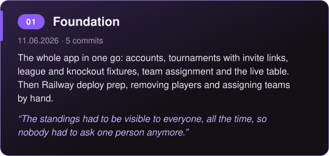</td>
    <td width="50%" valign="top">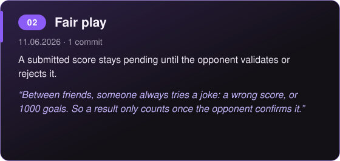</td>
  </tr>
  <tr>
    <td width="50%" valign="top">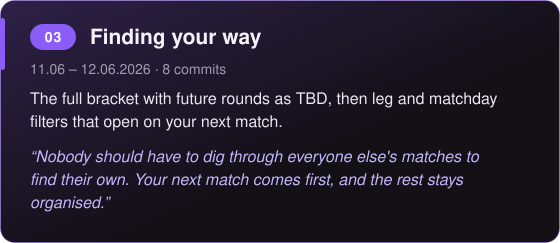</td>
    <td width="50%" valign="top">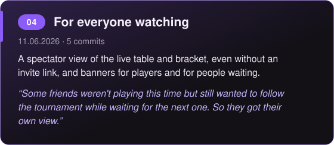</td>
  </tr>
  <tr>
    <td width="50%" valign="top">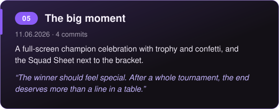</td>
    <td width="50%" valign="top">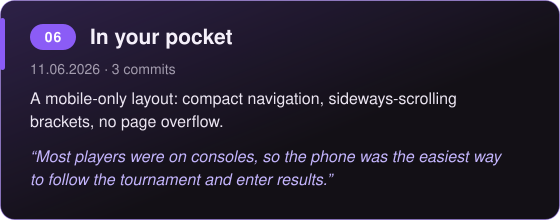</td>
  </tr>
  <tr>
    <td width="50%" valign="top">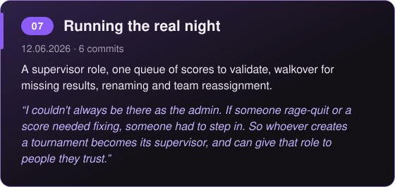</td>
    <td width="50%" valign="top">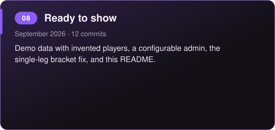</td>
  </tr>
</table>

<details>
<summary>The 8 phases as plain text</summary>

- **01 · Foundation** (11.06.2026 · 5 commits). The whole app in one go: accounts, tournaments with invite links, league and knockout fixtures, team assignment and the live table. Then Railway deploy prep, removing players and assigning teams by hand. *“The standings had to be visible to everyone, all the time, so nobody had to ask one person anymore.”*
- **02 · Fair play** (11.06.2026 · 1 commit). A submitted score stays pending until the opponent validates or rejects it. *“Between friends, someone always tries a joke: a wrong score, or 1000 goals. So a result only counts once the opponent confirms it.”*
- **03 · Finding your way** (11.06 – 12.06.2026 · 8 commits). The full bracket with future rounds as TBD, then leg and matchday filters that open on your next match. *“Nobody should have to dig through everyone else's matches to find their own. Your next match comes first, and the rest stays organised.”*
- **04 · For everyone watching** (11.06.2026 · 5 commits). A spectator view of the live table and bracket, even without an invite link, and banners for players and for people waiting. *“Some friends weren't playing this time but still wanted to follow the tournament while waiting for the next one. So they got their own view.”*
- **05 · The big moment** (11.06.2026 · 4 commits). A full-screen champion celebration with trophy and confetti, and the Squad Sheet next to the bracket. *“The winner should feel special. After a whole tournament, the end deserves more than a line in a table.”*
- **06 · In your pocket** (11.06.2026 · 3 commits). A mobile-only layout: compact navigation, sideways-scrolling brackets, no page overflow. *“Most players were on consoles, so the phone was the easiest way to follow the tournament and enter results.”*
- **07 · Running the real night** (12.06.2026 · 6 commits). A supervisor role, one queue of scores to validate, walkover for missing results, renaming and team reassignment. *“I couldn't always be there as the admin. If someone rage-quit or a score needed fixing, someone had to step in. So whoever creates a tournament becomes its supervisor, and can give that role to people they trust.”*
- **08 · Ready to show** (September 2026 · 12 commits). Demo data with invented players, a configurable admin, the single-leg bracket fix, and this README.

</details>

---

<a name="features"></a>
<p>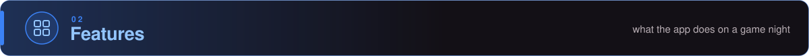</p>

Built around the actual game night: someone sets up a tournament, everybody plays, and nobody wants to argue about scores afterwards.

<table>
  <tr>
    <td width="33%" align="center" valign="top">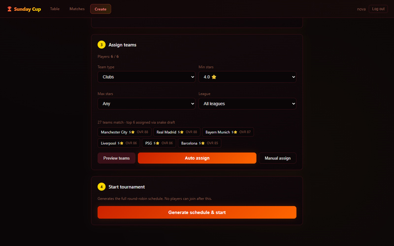<br><b>Fair team assignment</b><br><sub>the strongest matching FC 26 teams, one per player</sub></td>
    <td width="33%" align="center" valign="top">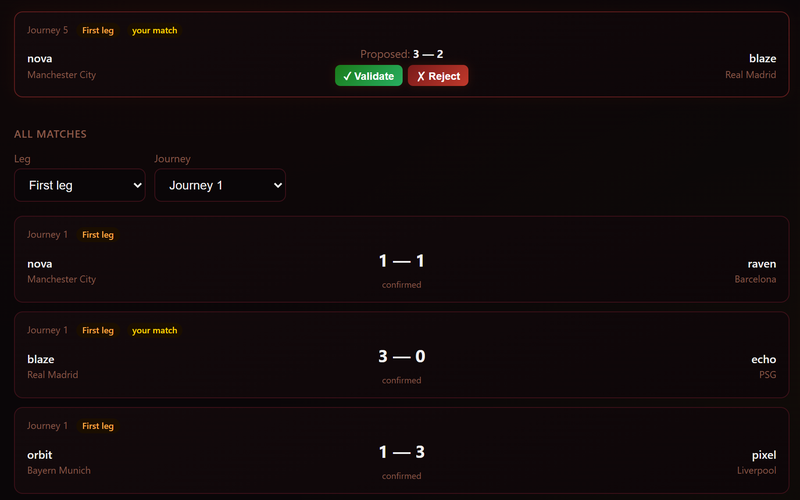<br><b>Score validation</b><br><sub>a result counts once the opponent confirms it</sub></td>
    <td width="33%" align="center" valign="top">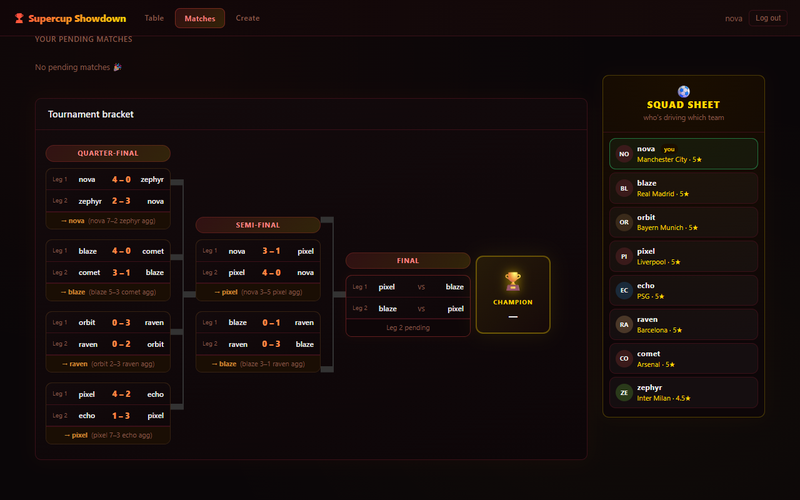<br><b>Live bracket</b><br><sub>every round up to the champion</sub></td>
  </tr>
  <tr>
    <td width="33%" align="center" valign="top">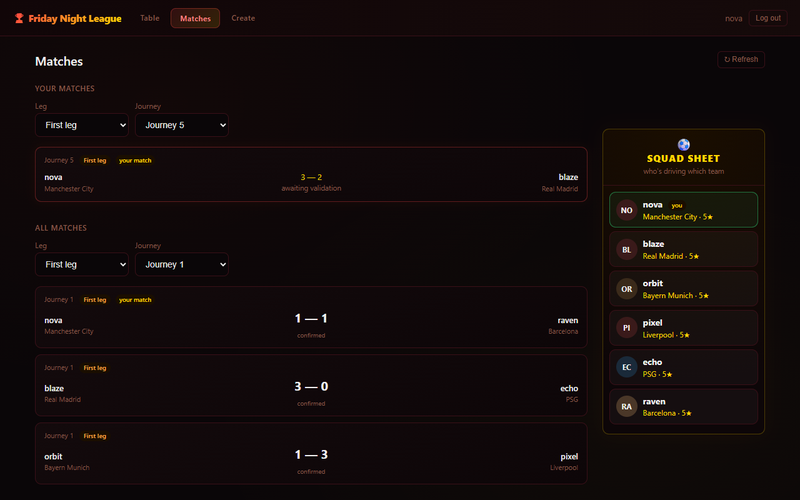<br><b>Your next match first</b><br><sub>leg and matchday filters instead of one long list</sub></td>
    <td width="33%" align="center" valign="top">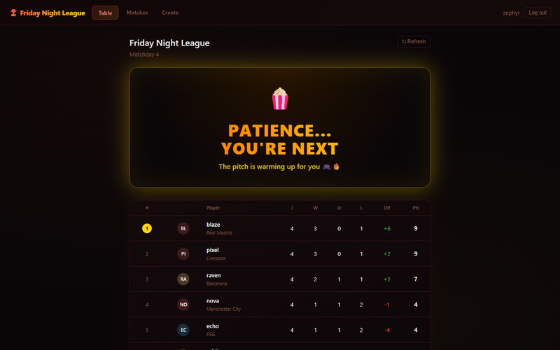<br><b>Spectator mode</b><br><sub>follow the tournament without playing in it</sub></td>
    <td width="33%" align="center" valign="top">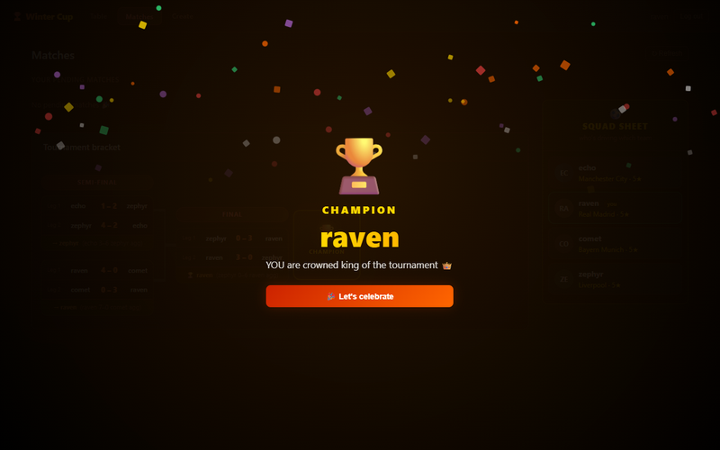<br><b>Champion celebration</b><br><sub>trophy and confetti when the final is decided</sub></td>
  </tr>
</table>

**Also in the app:** knockout rounds that advance by themselves · banners for players and for people waiting · works on a phone · invite links · league or knockout, 1 or 2 legs · supervisors, rename, walkover · activity log of every action.

### More about each feature

<details>
<summary><b>Fair team assignment</b> · the strongest matching FC 26 teams, one per player</summary>
<br>
<p align="center"></p>

Filter the 136 teams by clubs or national teams, star range and league, preview the result, then **Auto assign**. Each player gets one team, all taken from the top of the filtered pool, so the gap between the weakest and the strongest team stays small. You can also assign by hand, or reassign a team later from the Manage page.
</details>

<details>
<summary><b>Score validation</b> · a result only counts once the opponent confirms it</summary>
<br>
<p align="center"><br>
<sub><b>The opponent</b> sees the proposed score and validates or rejects it</sub></p>
<p align="center"><br>
<sub><b>Supervisors</b> get one queue of everything still waiting</sub></p>

One player enters the score, and it stays *pending*. Only the other player can accept it (you can't confirm your own), and a rejected score is cleared so both can resubmit. Supervisors can confirm or enter any score when someone has already gone home.
</details>

<details>
<summary><b>Knockout that runs itself</b> · the next round appears when the last result is in</summary>
<br>
<p align="center"></p>

As soon as the last tie of a round is confirmed, the server works out the winners (aggregate score over two legs, away goals as tie-breaker) and creates the next round. Nobody has to press "next round". If a match never gets played, the super-admin can force the round forward with a 0-0 walkover.
</details>

<details>
<summary><b>Live bracket</b> · from the first round to the champion, future rounds as TBD</summary>
<br>
<p align="center"></p>

Every tie shows leg 1, leg 2 and the aggregate with the player who goes through. Rounds that don't exist yet are already drawn as TBD, so everyone sees how far it is to the final. Single-leg cups show one game per tie.
</details>

<details>
<summary><b>Your next match first</b> · leg and matchday filters instead of one long list</summary>
<br>
<p align="center"></p>

A two-leg league with eight players has 56 games. So the Matches page opens on *your* next pending match and filters everything else by leg and matchday. The same filter works on the Manage page.
</details>

<details>
<summary><b>Spectator mode</b> · people who aren't playing can still follow along</summary>
<br>
<p align="center"></p>

Everyone who logs in lands on the live tournament, even without the invite link. People who aren't in it see the table and the bracket under a *„Patience… you're next“* banner instead of an empty page.
</details>

<details>
<summary><b>Banners that know who you are</b> · a cheer for players, patience for everyone else</summary>
<br>
<p align="center"></p>

Players get *„You're in the arena, &lt;name&gt;!“* and their own row highlighted. The banner depends on whether you actually play in this tournament, not on your role, so an admin who plays gets the cheer too.
</details>

<details>
<summary><b>Squad Sheet and champion celebration</b> · who drives which team, and a proper finish</summary>
<br>
<p align="center"></p>

Next to the bracket, the Squad Sheet lists every player with their team and stars, and the chips shrink as the field grows. When the final is decided, everyone gets a full-screen trophy with confetti, shown once per tournament on each device.
</details>

<details>
<summary><b>Works on a phone</b> · mobile-only layout, desktop untouched</summary>
<br>
<p align="center"></p>

On a phone the navigation wraps into a scrollable row, long names are cut off cleanly, and the bracket on the Table page scrolls sideways. All of this sits in one `@media` block, so the desktop layout is untouched.
</details>

<sub>All names in screenshots and the demo are invented (`seed_demo.py`). Team names come from the FC 26 player dataset.</sub>

---

<a name="learned"></a>
<p>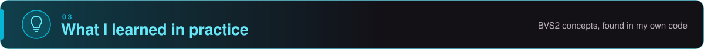</p>

Where topics from the module *Betriebssysteme und Verteilte Systeme 2* (TH Köln) show up in this code. Each excerpt is the smallest piece that shows the idea, with one comment per line; the link under it leads to the full code.

<details>
<summary></summary>
<br>

**In plain words.** The browser is the client and only draws. The Flask app is the server and only answers. Every page asks for its data with an HTTP request to a URL that names one thing (the matches of tournament 2, one match, one tournament) and gets JSON back. It's REST-*style* rather than strict REST, because a few URLs like `/start` or `/advance-round` name an action, not a thing.

The client, in the browser:
```js
const res  = await fetch(url, opts);    // CLIENT: send the HTTP request, wait for the response
const data = await res.json();          // the body is JSON -> turn it into a JS object
```
The server, in Flask:
```python
@routes_bp.route('/api/tournament/<int:tid>/matches')   # a RESOURCE: the matches of one tournament. GET only
def get_matches(tid):                                    # tid comes out of the URL, already an int
    # ... login check and database query (see full code)
        return jsonify([dict(r) for r in rows])          # rows -> list of dicts -> JSON body, status 200
```
Full code: [`static/app.js` lines 6–21](static/app.js#L6-L21) · [`routes.py` lines 422–442](routes.py#L422-L442)

> **Why I did it this way:** Everyone needed to see the same standings. One server holds the only true version of the tournament, and every phone or PC just asks it. Nobody has to install anything, a browser is enough.
</details>

<details>
<summary></summary>
<br>

**In plain words.** HTTP has no memory: every request arrives on its own. So at login Flask writes the user's ID into the **session**, which travels to the browser as a signed cookie. The browser sends it back with every request, and every protected route reads it again. The server keeps nothing in between.

```python
app.secret_key = os.environ.get('SECRET_KEY', secrets.token_hex(32))   # SIGNS the cookie so the client cannot forge it
session['user_id'] = user['id']          # LOGIN: the id goes into the session -> the signed cookie
if 'user_id' not in session:             # EVERY request: read the cookie again, nothing was remembered
    return jsonify({'error': 'Not logged in'}), 401   # no cookie -> 401, not a silent 200
```
Full code: [`app.py` line 9](app.py#L9) · [`auth.py` lines 34–50](auth.py#L34-L50) · [`routes.py` lines 19–22](routes.py#L19-L22)

> **Why I did it this way:** HTTP forgets who you are after every request. The session cookie reminds the server, so every player has their own profile and can only enter their own results.
</details>

<details>
<summary></summary>
<br>

**In plain words.** The status code lets the client react without reading the error text. Submitting a score checks four things in order, and each "no" has its own code. Without the explicit number, Flask would answer 200 and the error would look like a success.

```python
# 1. are both scores there?          no -> 400: the request itself is incomplete
if hs is None or as_ is None: return jsonify({'error': 'Both scores required'}), 400
# 2. does the match exist?           no -> 404: request fine, the thing is not there
if not match: return jsonify({'error': 'Match not found'}), 404
# 3. are you in this tournament?     no -> 403: you are known, but not allowed
if not my_part: return jsonify({'error': 'Not in this tournament'}), 403
# 4. does it fit the current state?  no -> 409: the result is already official
if match['home_score'] is not None: return jsonify({'error': 'Result already validated'}), 409
```
Full code: [`routes.py` lines 446–481](routes.py#L446-L481)

> **Why I did it this way:** When something goes wrong, the page needs to know what happened: not allowed, not found, or bad input. Clear status codes let it show a clear message instead of just failing.
</details>

<details>
<summary></summary>
<br>

**In plain words.** A request is *idempotent* if sending it twice leaves the server in the same state as sending it once. `POST` normally isn't, but joining a tournament is built that way: the second time, the server finds you already in and changes nothing. A double tap on a phone does no harm.

```python
# look up: is this user already in this tournament?   (None = not yet)
already = db.execute('SELECT id FROM participants WHERE tournament_id=? AND user_id=?', (tid, session['user_id'])).fetchone()
# yes -> answer ok and change NOTHING: the 2nd request ends here
if already: return jsonify({'ok': True, 'message': 'Already joined'})
# ... (is the tournament full? see full code)
# only the FIRST request gets here and writes the row
db.execute('INSERT INTO participants (tournament_id, user_id) VALUES (?,?)', (tid, session['user_id']))
```
Full code: [`routes.py` lines 130–149](routes.py#L130-L149)

> **Why I did it this way:** Most players were on their phones, sometimes with a bad connection, and people tap twice. Sending the same action again must not count it twice.
</details>

<details>
<summary></summary>
<br>

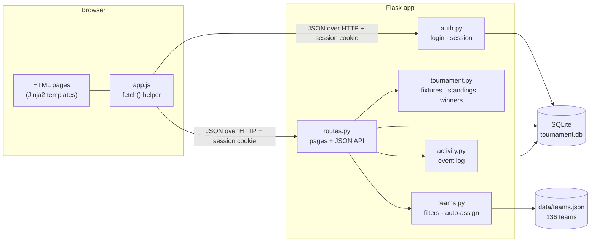
</details>

---

<a name="run"></a>
<p>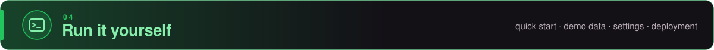</p>

<a name="quick-start"></a>
<p></p>

With Python 3.11 or newer (on Windows, double-clicking **`run_local.bat`** does all of this for you):

```bash
git clone https://github.com/WaliGl0RY/fc26-tournament.git && cd fc26-tournament
pip install -r requirements.txt
python app.py
```

Then open http://127.0.0.1:5000. The database (`tournament.db`) is created on first start.

<details>
<summary></summary>
<br>

Run `python seed_demo.py` once, before `python app.py`.

`seed_demo.py` adds eight invented players (`nova`, `blaze`, `pixel` …) and an `admin` account, all with PIN **`0000`**, plus three tournaments: a league with one score waiting for validation, a knockout cup before its final, and a finished cup. Log in as `nova` to land on the live cup. The script also prints one invite link per tournament: log out, open a link, log in, and that tournament is selected. It refuses to touch a database that already has users.
</details>

<details>
<summary></summary>
<br>

| Variable | Default | What it does |
|---|---|---|
| `ADMIN_USERNAME` | `admin` | The account that sees the activity log, assigns supervisors, renames tournaments and can override any score |
| `SECRET_KEY` | random at every start | Signs the session cookie. **Set it**, or every restart logs everyone out |
| `DB_PATH` | `./tournament.db` | Where the SQLite file lives |
| `FLASK_DEBUG` | `false` | `true` for auto-reload while developing |

```bash
ADMIN_USERNAME=alex SECRET_KEY=change-me python app.py          # PowerShell: $env:ADMIN_USERNAME="alex"; python app.py
```

> Logins use a name and a 4-digit PIN, made for a group of friends on one evening. See [Security scope](#security-scope).

**Team data:** `data/teams.json` ships with the repo. To rebuild it from the Kaggle FC 26 player dataset: `python scripts/build_teams_json.py --csv players.csv`.
</details>

<details>
<summary></summary>
<br>

The app ran on **Railway**. Railway built the repository into a container image and ran it as a container. Three small files in the repo were all it needed: `requirements.txt` (Flask and gunicorn), `.python-version` (Python 3.11) and the `Procfile`, whose start command `gunicorn app:app` ran the app with gunicorn instead of Flask's development server.

**The database lived on a volume.** A container's own files are thrown away on every redeploy, and a SQLite file stored there would have gone with them. A Railway volume was mounted into the container instead, with `DB_PATH` pointing to the database file inside it, so the data survived every redeploy.

This setup was one instance by design: one container, one SQLite file on one volume. The app is offline now.
</details>

<details>
<summary></summary>
<br>

```
fc26-tournament/
├── app.py              ← Flask app: secret key, blueprints, database init
├── auth.py             ← register · login · logout · /api/me (session)
├── routes.py           ← pages + JSON API: tournaments, matches, validation, logs
├── tournament.py       ← round-robin, knockout pairs, aggregate winners, standings
├── teams.py            ← team filters + auto-assign
├── database.py         ← SQLite schema + in-place migrations
├── activity.py         ← event log helper
├── seed_demo.py        ← demo data with invented players
├── data/teams.json     ← 136 FC 26 clubs and national teams
├── scripts/            ← build_teams_json.py (rebuilds teams.json)
├── templates/          ← login · dashboard (Table) · matches · admin (Create) · manage · logs
├── static/             ← style.css · app.js
├── docs/               ← README images
├── run_local.bat       ← Windows one-click start
└── Procfile            ← gunicorn app:app
```
</details>

---

<a name="notes"></a>
<p>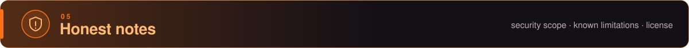</p>

<a name="security-scope"></a>
<p></p>

I built this for a small group of friends who trust each other. Every player sets their own simple PIN, so everyone has their own profile. It keeps profiles apart; it doesn't keep attackers out. It isn't hardened, so don't deploy it publicly as it is.

<a name="known-limitations"></a>
<p></p>

- **Race on round advance:** two confirmations at the same moment could create the next knockout round twice (not with the single worker it ran on).
- **User input isn't escaped** when the pages display it.
- **Logins are simple on purpose:** 4-digit PINs, stored in plain text, with no attempt limit.
- **Some bad input returns 500** instead of 400.
- **One SQLite file, one server:** no built-in backup, no running several instances.
- **Knockout Matches page on narrow screens** starts partly off-screen below about 900px.
- **No automated tests:** everything was tested by hand and by playing.

<a name="license"></a>
<p></p>

[MIT](LICENSE)
