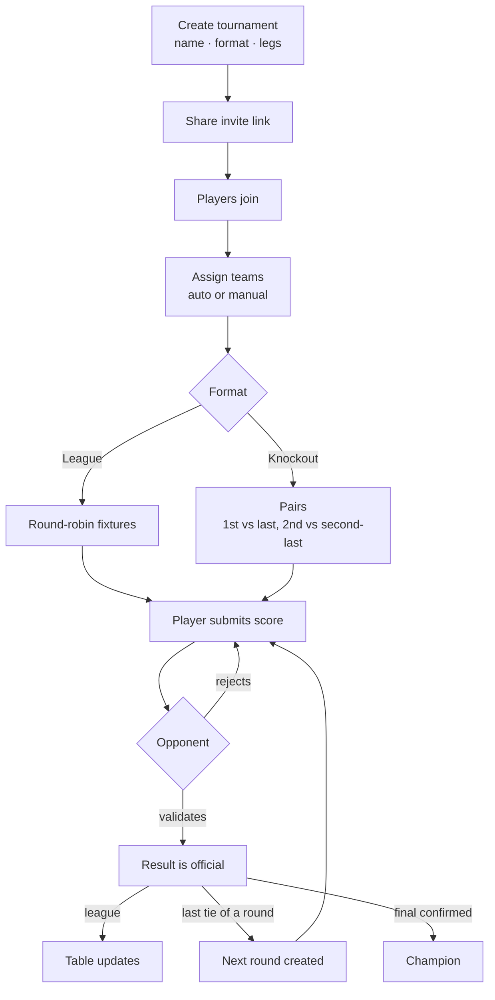
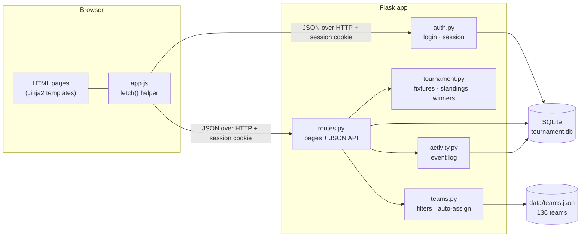

<p align="center">
  
</p>

<p align="center">
  <b>Run an FC 26 night with your friends</b>: one invite link, a league or a knockout cup, and no score counts until the opponent confirms it.<br>
  <sub>A small Flask + SQLite web app with plain JavaScript pages. Runs on a laptop, or deployed with gunicorn.</sub>
</p>

<p align="center">
  
  
  
  <a href="LICENSE"></a>
</p>

<p align="center">
  <a href="#features"></a>
  <a href="#how-it-works"></a>
  <a href="#how-it-grew"></a>
  <a href="#concepts-in-practice"></a>
  <a href="#quick-start"></a>
  <a href="#project-structure"></a>
</p>

<p align="center">
  
</p>

## Features

The app is built around the actual game night: someone sets up a tournament, everybody plays on one console, and nobody wants to argue about scores afterwards. **Pick one to see it:**

<details>
<summary><b>Fair team assignment</b> · the strongest matching FC 26 teams, one per player</summary>
<br>
<p align="center"></p>

Filter the 136 teams by clubs or national teams, star range and league, preview the result, then **Auto assign**. Each player gets one team, all taken from the top of the filtered pool, so the gap between the weakest and the strongest team stays small. You can also assign by hand, or reassign a team later from the Manage page.
</details>

<details>
<summary><b>Score validation</b> · a result only counts once the opponent confirms it</summary>
<br>
<p align="center"><br>
<sub><b>The opponent</b> sees the proposed score and validates or rejects it</sub></p>
<p align="center"><br>
<sub><b>Supervisors</b> get one queue of everything still waiting</sub></p>

One player enters the score, and it stays *pending*. Only the other player can accept it (you can't confirm your own), and a rejected score is cleared so both can resubmit. Supervisors can confirm or enter any score when someone has already gone home.
</details>

<details>
<summary><b>Knockout that runs itself</b> · the next round appears when the last result is in</summary>
<br>
<p align="center"></p>

As soon as the last tie of a round is confirmed, the server works out the winners (aggregate score over two legs, away goals as tie-breaker) and creates the next round. Nobody has to press "next round". If a match never gets played, the super-admin can force the round forward with a 0-0 walkover.
</details>

<details>
<summary><b>Live bracket</b> · from the first round to the champion, future rounds as TBD</summary>
<br>
<p align="center"></p>

Every tie shows leg 1, leg 2 and the aggregate with the player who goes through. Rounds that don't exist yet are already drawn as TBD, so everyone sees how far it is to the final. Single-leg cups show one game per tie.
</details>

<details>
<summary><b>Your next match first</b> · leg and matchday filters instead of one long list</summary>
<br>
<p align="center"></p>

A two-leg league with eight players has 56 games. So the Matches page opens on *your* next pending match and filters everything else by leg and matchday. The same filter works on the Manage page.
</details>

<details>
<summary><b>Spectator mode</b> · people who aren't playing can still follow along</summary>
<br>
<p align="center"></p>

Everyone who logs in lands on the live tournament, even without the invite link. People who aren't in it see the table and the bracket under a *„Patience… you're next“* banner instead of an empty page.
</details>

<details>
<summary><b>Banners that know who you are</b> · a cheer for players, patience for everyone else</summary>
<br>
<p align="center"></p>

Players get *„You're in the arena, &lt;name&gt;!“* and their own row highlighted. The banner depends on whether you actually play in this tournament, not on your role, so an admin who plays gets the cheer too.
</details>

<details>
<summary><b>Squad Sheet and champion celebration</b> · who drives which team, and a proper finish</summary>
<br>
<p align="center"></p>

Next to the bracket, the Squad Sheet lists every player with their team and stars, and the chips shrink as the field grows. When the final is decided, everyone gets a full-screen trophy with confetti, shown once per tournament on each device.
</details>

<details>
<summary><b>Works on a phone</b> · mobile-only layout, desktop untouched</summary>
<br>
<p align="center"></p>

On a phone the navigation wraps into a scrollable row, long names are cut off cleanly, and the bracket on the Table page scrolls sideways. All of this sits in one `@media` block, so the desktop layout is untouched.
</details>

**Also in the app:** invite links · two formats (league or knockout, 1 or 2 legs) · supervisor role, rename, walkover, delete · activity log of every action.

<sub>All names in screenshots and the demo are invented (`seed_demo.py`). Team names come from the FC 26 player dataset.</sub>

<a name="how-it-works"></a>
## How it works

**A tournament, start to finish**



**The architecture**



<a name="how-it-grew"></a>
## How it grew

| When | Commits | What happened |
|---|---|---|
| **11.06.2026**, 01:11–01:22 | 3 | The whole app lands in one commit (about 3,500 lines), then deploy prep for Railway |
| 11.06, 01:54–02:45 | 3 | Remove player, **score validation**, manual team assignment |
| 11.06, 04:03–05:30 | 17 | The presentation push: bracket with TBD rounds, spectator mode, banners, Squad Sheet, champion celebration, then the mobile layout |
| **12.06.2026**, 21:58–22:47 | 9 | Tools for running it live: supervisors, walkover, team reassignment, rename, leg and matchday filters, validation queue |
| **29.09.2026** | 6 | Cleanup: configurable admin, single-leg bracket fix, demo data, this README |

<a name="concepts-in-practice"></a>
## Concepts in practice

Where topics from the module *Betriebssysteme und Verteilte Systeme 2* (TH Köln) show up in this code.

<details>
<summary><b>Client-server with a REST-style JSON API</b> · the browser asks, Flask answers in JSON</summary>
<br>

**In plain words.** The browser only draws. Each page loads as an almost empty shell, then its JavaScript asks the server for data and renders it. The server never builds a table or a bracket into HTML: it answers requests such as `GET /api/tournament/2/matches` or `POST /api/match/17/validate` with JSON. The things the app works with (tournaments, matches, participants) each have their own URL, and the HTTP method says what happens to them. It's REST-*style* rather than strict REST, because a few endpoints like `/start` or `/advance-round` are actions, not resources.

[`static/app.js` lines 6–21](static/app.js#L6-L21): the one helper every page uses
```js
async function api(url, method = 'GET', body = null) {
  const opts = {
    method,
    headers: { 'Content-Type': 'application/json' },
    credentials: 'same-origin'
  };
  if (body) opts.body = JSON.stringify(body);
  try {
    const res  = await fetch(url, opts);
    const data = await res.json();
    return data;
  } catch (e) {
    return { error: 'Network error' };
  }
}
```

The server side of the same contract, three routes from [`routes.py`](routes.py#L422) ([L422](routes.py#L422), [L446](routes.py#L446), [L728](routes.py#L728)):
```python
@routes_bp.route('/api/tournament/<int:tid>/matches')                      # GET: read
@routes_bp.route('/api/match/<int:match_id>/result', methods=['POST'])     # POST: act
@routes_bp.route('/api/tournament/<int:tid>/delete', methods=['DELETE'])   # DELETE: remove
```

> **[CHECK] Why I did it this way:** *In your words. For example, why the pages fetch JSON instead of rendering everything on the server, and what that made easier (live refresh, spectator view, same API for every page).*
</details>

<details>
<summary><b>Stateless HTTP with a session cookie</b> · the server forgets you after every request</summary>
<br>

**In plain words.** HTTP has no memory: every request arrives on its own, and the server doesn't know who sent the previous one. So after a successful login, Flask puts the user's ID into a **session cookie**. The browser sends that cookie with every following request, and the server reads it again each time. The cookie is signed with `secret_key`, so nobody can change the ID in it and become someone else. Every protected route starts by checking it.

[`auth.py` lines 43–48](auth.py#L43-L48) (login), [`app.py` line 9](app.py#L9) (key), [`routes.py` lines 19–22](routes.py#L19-L22) (the check)
```python
# auth.py: after the PIN is checked, remember the user in the signed cookie
if not user or user['pin'] != pin:
    return jsonify({'error': 'Wrong username or PIN'}), 401
session['user_id'] = user['id']
session['username'] = user['username']

# app.py: the key that signs the cookie
app.secret_key = os.environ.get('SECRET_KEY', secrets.token_hex(32))

# routes.py: first line of every protected route
def require_login():
    if 'user_id' not in session:
        return jsonify({'error': 'Not logged in'}), 401
```

Without a `SECRET_KEY` in the environment, a random key is generated at every start, so a restart logs everyone out. That's why the setup recommends setting one.

> **[CHECK] Why I did it this way:** *In your words. For example, why a signed cookie and not a server-side session table, and why a 4-digit PIN was enough for a game night.*
</details>

<details>
<summary><b>Explicit HTTP status codes</b> · every failure says what kind of failure it is</summary>
<br>

**In plain words.** A request can fail for very different reasons, and the status code tells the client which one it is without reading the text: **400** your input is wrong, **401** you're not logged in, **403** you're logged in but it's not your match, **404** that match doesn't exist, **409** the request clashes with the current state (already validated, or you already submitted and are waiting for your opponent). Flask would answer **200** for all of them if the code didn't set it.

[`routes.py` lines 452–476](routes.py#L452-L476): submitting a score
```python
if hs is None or as_ is None: return jsonify({'error': 'Both scores required'}), 400
if hs < 0 or as_ < 0: return jsonify({'error': 'Scores cannot be negative'}), 400
match = db.execute('SELECT * FROM matches WHERE id=?', (match_id,)).fetchone()
if not match: return jsonify({'error': 'Match not found'}), 404
# ...
if not my_part: return jsonify({'error': 'Not in this tournament'}), 403
if match['home_score'] is not None: return jsonify({'error': 'Result already validated'}), 409
if match['pending_by'] == session['username']:
    return jsonify({'error': 'You already submitted — waiting for opponent to validate'}), 409
```

> **[CHECK] Why I did it this way:** *In your words. For example, what the frontend does differently with a 409 than with a 403.*
</details>

<details>
<summary><b>Idempotency</b> · joining twice is the same as joining once</summary>
<br>

**In plain words.** An operation is *idempotent* if doing it twice leaves the server in the same state as doing it once. `POST` isn't idempotent by definition, but joining a tournament is made idempotent on purpose: if you're already in, the server answers `ok` and changes nothing. A double tap on a phone, or opening the invite link again, does no harm. Submitting a score is the deliberate opposite. A second submission is refused with 409, because a result must not quietly change.

[`routes.py` lines 130–140](routes.py#L130-L140)
```python
@routes_bp.route('/api/tournament/<int:tid>/join', methods=['POST'])
def join_tournament(tid):
    # ... login check, tournament exists, still in setup ...
    already = db.execute('SELECT id FROM participants WHERE tournament_id=? AND user_id=?',
                         (tid, session['user_id'])).fetchone()
    if already: return jsonify({'ok': True, 'message': 'Already joined'})
```

> **[CHECK] Why I did it this way:** *In your words. For example, what went wrong (or could have) when people opened the invite link twice.*
</details>

<a name="quick-start"></a>
## Quick start

**Windows, one click:** double-click **`run_local.bat`**. It creates a virtual environment, installs `requirements.txt`, starts the server and opens http://127.0.0.1:5000.

**Any OS, by hand** (Python 3.11 or newer):

```bash
git clone https://github.com/wragoub-design/tournament-app.git
cd tournament-app
python -m venv .venv
source .venv/bin/activate          # Windows: .venv\Scripts\activate
pip install -r requirements.txt
python seed_demo.py                # optional: demo players and tournaments
python app.py                      # → http://127.0.0.1:5000
```

The database (`tournament.db`) is created on first start. **Demo data:** `seed_demo.py` adds eight invented players (`nova`, `blaze`, `pixel` …) and an `admin` account, all with PIN **`0000`**, plus three tournaments: a league with one score waiting for validation, a knockout cup before its final, and a finished cup. Log in as `nova` to land on the live cup. The script also prints one invite link per tournament: log out, open a link, log in, and that tournament is selected. It refuses to touch a database that already has users.

**Configuration** (all optional, as environment variables):

| Variable | Default | What it does |
|---|---|---|
| `ADMIN_USERNAME` | `admin` | The account that sees the activity log, assigns supervisors, renames tournaments and can override any score |
| `SECRET_KEY` | random at every start | Signs the session cookie. **Set it**, or every restart logs everyone out |
| `DB_PATH` | `./tournament.db` | Where the SQLite file lives |
| `FLASK_DEBUG` | `false` | `true` for auto-reload while developing |

```bash
ADMIN_USERNAME=alex SECRET_KEY=change-me python app.py          # PowerShell: $env:ADMIN_USERNAME="alex"; python app.py
```

**Deploying:** the `Procfile` runs `gunicorn app:app` (used on Railway). gunicorn doesn't run on Windows, so use `python app.py` there.

> Logins use a name and a 4-digit PIN, made for a group of friends on one evening. PINs are stored in plain text, so don't run this as a public service with real accounts.

**Team data:** `data/teams.json` ships with the repo. To rebuild it from the Kaggle FC 26 player dataset: `python scripts/build_teams_json.py --csv players.csv`.

<a name="project-structure"></a>
## Project structure

```
tournament-app/
├── app.py              ← Flask app: secret key, blueprints, database init
├── auth.py             ← register · login · logout · /api/me (session)
├── routes.py           ← pages + JSON API: tournaments, matches, validation, logs
├── tournament.py       ← round-robin, knockout pairs, aggregate winners, standings
├── teams.py            ← team filters + auto-assign
├── database.py         ← SQLite schema + in-place migrations
├── activity.py         ← event log helper
├── seed_demo.py        ← demo data with invented players
├── data/teams.json     ← 136 FC 26 clubs and national teams
├── scripts/            ← build_teams_json.py (rebuilds teams.json)
├── templates/          ← login · dashboard (Table) · matches · admin (Create) · manage · logs
├── static/             ← style.css · app.js
├── docs/               ← README images
├── run_local.bat       ← Windows one-click start
└── Procfile            ← gunicorn app:app
```

## How I built it

> **[CHECK]** *Draft, to be rewritten in your own words.* I built this app over two nights in June 2026 with **Claude** (Anthropic) as my coding assistant. *[Say honestly how the work was split: what you decided (features, how it should feel on the night, what to fix next), what Claude wrote, what you changed or tested yourself, and what you learned doing it this way.]*

## What I'd build next

> **[CHECK]** *Your list. One item came up while reviewing the code:*
>
> - **Make round advancement race-free.** When the last result of a knockout round is confirmed, the server first checks "are all results in?" and only then creates the next round, as two separate steps. If two confirmations arrived at the same moment, both could pass the check and create the round twice. Today's single gunicorn worker handles one request at a time, so it can't happen yet. Running more workers would open the door, and doing the check and the insert in one transaction would close it.
> - *…*

## License

[MIT](LICENSE)
